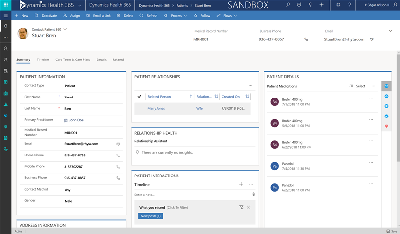

# The Dynamics 365 Health Accelerator

With the [Dynamics 365 Health Accelerator](https://appsource.microsoft.com/product/dynamics-365/msemr.healthcarecommondatamodel?tab=Overview), you can rapidly develop healthcare solutions using Fast Healthcare Interoperability Resources (FHIR) entities such as patient, condition, and care plan. 

The Health Accelerator was announced in July 2018 at Ignite, and the initial release includes these features:
-	extension of the Common Data Model (CDM) to include concepts for health, including entity definitions and relationships
-	built-in forms, such as **Patient**, **Practitioner**, and **Related person**, which you can leverage or enhance for customer engagement
-	a built-in app to provide a sample of what's possible on the Unified Interface
-	support for building canvas and model-driven apps in PowerApps
-	support for extending the model with custom entities, forms, and relationships to meet your business needs
-	support for analytics
-	a solution for Common Data Service (CDS) for Apps that you can install from AppSource

In future releases, we'll look at enabling artificial-intelligence scenarios and providing a baseline for doing AI on Dynamics 365 Accelerators.

## Site-map extensions 
With the Health Accelerator plugged in to the Dynamics 365 platform, you can optimize various aspects of care coordination and segment patients and providers based on EMR data. You can also manage the care continuum of all patients by leveraging the entire customer-engagement solution within Dynamics 365. 

This accelerator adds another layer to the rich feature set in the base Dynamics 365 functionality by adding a ribbon to help you manage the special needs of your health organization. This ribbon contains entities to record patient data, appointments, procedures, nutrition orders, care plans, and a multitude of other functions. 
              
## Entities and workflows
The Healthcare Accelerator provides a specific set of primary entities in support of the FHIR HL7 specification. The solution provides these entities:

| | | | |
| ------- | -----------------|------------------| ------------|
| Patients | Healthcare Services | Care Plans | Encounters |
|Practitioners | Clinical Impression Problems | Risk Assessments |Specimens|
|Organizations | Allergy Intolerances | Observations |Medications |
|Devices | Medication Administration | Episodes of Care |Locations |
| Healthcare Services | Medication Requests | | |

The accelerator also includes these workflows:

| | | | 
| ------- | -----------------|------------------| 
|Tasks |	Appointments (EMR) |	Procedures|
|Nutrition Orders |	Referral Requests 	|

## Accelerator forms 
The Dynamics 365 Health Accelerator combines standard CRM entities with customized entities to make it easier to build solutions on top. This section describes examples of built-in forms and views that demonstrate these entities. 

### Patient/Practitioner 360 
This view shows EMR data directly within a patient or practitioner-specific form in Dynamics. The data model shows appointments, procedures, medications, and other patient/practitioner data in context in a user-friendly interface. 

                                             
### Patient/Provider Timeline 
This view provides a sequential look at all activities that have occurred with the patient or provider. The timeline provides the ability to scale, leveraging a slider, and interact with data directly.     

 
### Care Team Viewer 
A clear view of which member of a patient's care team owns each facet of care is paramount. This view clearly and and concisely shows the people who are responsible for the patient’s care.  

 
## Additional Resources
- Download the Healthcare Accelerator from [AppSource](https://appsource.microsoft.com/product/dynamics-365/msemr.healthcarecommondatamodel?tab=Overview) 
- The Healthcare data model, solutions, data samples, Power BI examples, SDK extensions, and more are provided as part of the open-source creative license and available on [GitHub](https://github.com/Microsoft/Dynamics-365-Industry-Accelerators/tree/master/health). 
- [More details about the Health Accelerator](https://community.dynamics.com/365/b/healthaccelerator/archive/2018/07/19/dynamics-365-health-accelerator-solution-first-look)
- [Additional topics on the accelerators](https://community.dynamics.com/365/b/dynamics365isvsuccess/archive/2018/08/01/dynamics-365-brings-industry-focus-through-the-microsoft-power-platform-and-solution-accelerators).
- This [blog post](https://community.dynamics.com/365/b/dynamics365isvsuccess/archive/2018/10/30/early-isvs-building-on-the-new-higher-education-accelerator-and-the-microsoft-power-platform) shows some examples of ISVs building solutions on the Higher Education Accelerator.
