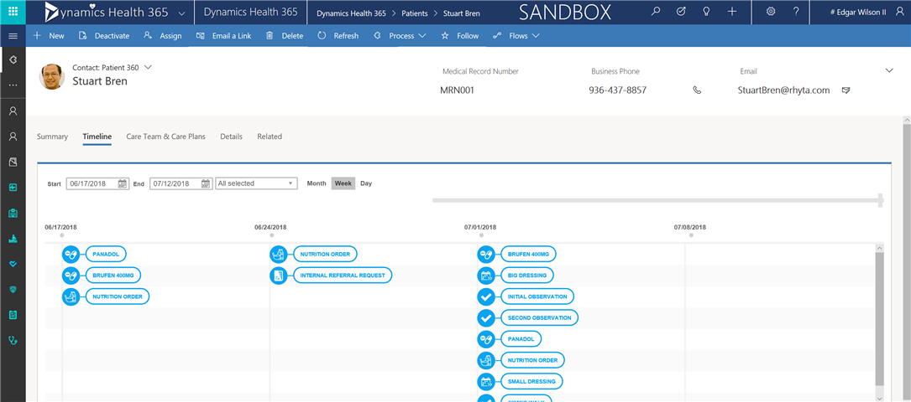

# The Dynamics 365 Health Accelerator

The [Dynamics 365 Health Accelerator](https://appsource.microsoft.com/product/dynamics-365/msemr.healthcarecommondatamodel?tab=Overview) allows you to rapidly develop healthcare solutions using FHIR entities such as patient, condition, and care plan. 

The initial release of the Health Accelerator (announced in July 2018 at Ignite) provides:
-	extending the CDM to include concepts for health, including entity definitions and relationships
-	out-of-the-box Customer Engagement forms such as **Patient**, **Practitioner**, and **Related person**, which can be leveraged or enhanced
-	an out-of-the-box app to provide a sample of what's possible on the Unified Interface
-	support for building canvas and model-driven apps in PowerApps
-	support to extend the model (new entities, forms, and relationships) to meet your business needs
-	support for analytics
-	solution for Common Data Service for Apps that you can install from AppSource

In future releases, we'll look at enabling artificial-intelligence scenarios and providing a baseline for doing AI on Dynamics 365 Accelerators.

## Site Map Extensions 
With the Dynamics Health 365 Accelerator plugged in to the Dynamics 365 platform, you can optimize various aspects of care coordination, segment patients & provider based on EMR data as well as manage the care continuum of all patients leveraging the entire customer engagement solution within Dynamics 365. 

Dynamics Health 365 adds another layer to the rich feature set in the base Dynamics 365 functionality by adding a new ribbon to help manage the special needs of your health organization. This ribbon contains entities to record patient data, appointments, procedures, nutrition orders, Care Plans, and a multitude of other functions. 
              
## Entities & Workflows
The Healthcare accelerator provides a specific set of primary entities in support of the FHIR HL7 specification. Below are the entities that have been provided in the solution:
| | | | |
| ------- | -----------------|------------------| ------------|
| Patients |	Healthcare Services |	Care Plans |	Encounters |
|Practitioners |	Clinical Impression Problems |	Risk Assessments 	|Specimens|
|Organizations |	Allergy Intolerances |	Observations 	|Medications |
|Devices |	Medication Administration |	Episodes of care 	|Locations |
| 	Healthcare Services |	Medication Requests |	

There are also a set of workflows included in the accelerator:
| | | | 
| ------- | -----------------|------------------| 
|Tasks |	Appointments (EMR) |	Procedures|
|Nutrition Orders |	Referral Requests 	|

## Accelerator Forms 
The Dynamics 365 Health Accelerator utilizes out-of-the-box CRM entities along with customized entities to make it easier to build new solutions on top. Below are some examples of some OOB forms and views which have been created to demonstrate these entities. 

## Patient/Practitioner 360 

The ability to see EMR data directly within a patient or practitioner-specific form in Dynamics. The data model has been built to allow for Appointment, Procedure, Medication, and other patient/practitioner data can be seen directly in context in an extremely user-friendly interface. 

                                             
### Patient/Provider Timeline 
Included with the Dynamics Health 365 Accelerator is a built-in patient/provider timeline which displays a sequential view of all activities that have occurred with the patient or provider. The timeline provides the ability to scale leveraging a slider and allows for the user to interact with data directly within the timeline.     

 
 
### Care Team Viewer 
A clear view into who is responsible for the various facets of care within a patient’s care team is paramount. Therefore, within the Dynamics Health 365 Accelerator there is a clear and concise care team viewer that allows users to have a visual of who’s responsible for the patient’s care.  

 
## Additional Resources
- Download the Healthcare Accelerator from [AppSource](https://appsource.microsoft.com/product/dynamics-365/msemr.healthcarecommondatamodel?tab=Overview) 
- The Healthcare data model, solutions, data samples, Power BI examples, SDK extensions, and more are provided as part of the open source creative license and available on [GitHub](https://github.com/Microsoft/Dynamics-365-Industry-Accelerators/tree/master/health). 
- More details about the Health Accelerator can be found [here](https://community.dynamics.com/365/b/healthaccelerator/archive/2018/07/19/dynamics-365-health-accelerator-solution-first-look)
- Additional support topics on the Accelerators can be found [here](https://community.dynamics.com/365/b/dynamics365isvsuccess/archive/2018/08/01/dynamics-365-brings-industry-focus-through-the-microsoft-power-platform-and-solution-accelerators).
- To see some examples of ISVs building solutions on the Higher Education Accelerator please read the blog post [here](https://community.dynamics.com/365/b/dynamics365isvsuccess/archive/2018/10/30/early-isvs-building-on-the-new-higher-education-accelerator-and-the-microsoft-power-platform).
