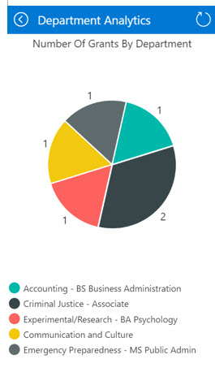

---

title: Dynamics 365 Higher Education Accelerator \| Microsoft Docs

description: Develop higher education solutions with the extensions to Common Data Model and the built-in forms, views, and dashboards of the Dynamics 365 Higher Education Accelerator.

author: MeenooRami

ms.service: common-data-model

ms.reviewer: Deonhe

ms.topic: article

ms.date: 12/20/2019

ms.author: merami

---

# The Dynamics 365 Higher Education Accelerator

With the [Dynamics 365 Higher Education

Accelerator](https://appsource.microsoft.com/product/dynamics-365/mshied.highereducationcommondatamodel?tab=Overview),

you can develop solutions that are based on entities and attributes that higher-education institutions use. The accelerator includes entities around student engagement and additional entities around internships, scholarships, grants, and accomplishments. The accelerator includes entities, fields, forms, views, and dashboards.

The accelerator now includes the following features:

- Extensions to Common Data Model to include concepts for higher education, including entity definitions and relationships.

- Student portal where students can view courses events, and see the history of courses and applications.

- Business partner dashboard to provide any organization that is willing to engage with the university for events, hackathons, internships, scholarships, and grants.

- Accomplishment captures any work completed by students outside of a course such as hackathons or awards.

- Grants phone app allows research faculty to keep track of applications and approval of grants to which they've applied.

- All personas including students, business partners, and faculty members have access to rich reporting on the students applying for internships, grants, and scholarships.

- System views that provide easy access to entities such as students, faculty, extracurricular activities, previous education, test scores, courses, academic periods, programs, test types, registration status, and areas of interest.

- Sample apps to show some of the possibilities of the unified interface.

- Example Dynamics 365 dashboards and Power BI dashboards that provide analytics for completed courses and allow drilling into details about student performance, instructor effectiveness, and course feedback.

- Support for building additional canvas and model-driven apps in Power Apps.

- A solution that you can deploy and install from AppSource or GitHub.

## Site-map extensions

With the Dynamics 365 Higher Education Accelerator, institutions can optimize student and faculty engagement, improve institutional effectiveness, predict outcomes, and gain insights from analytics. When the accelerator is installed into Dynamics 365, the experience is transformed into one specifically built for higher education and one that allows institutions to quickly build Power Apps
and Power BI visualizations.

Higher education institutions can build their business processes on top of the entities in the accelerator. The ribbon customizations contain entities to record student, faculty, and alumni interactions, business partner interactions, appointments, events, and outreach.

## Entities and workflows

This accelerator provides these entities to support the needs of higher education institutions:

| Accounts | Course | Previous Education | Student Program Type |

|------------------------------|---------------------------|------------------------|----------------------|

| Contacts | Course History | Program | Student Status |

| Academic Period | Course Section | Program Level | Test Score |

| Academic Period Detail | Education Level | Program Version | Test Type |

| Area of Interest | Extra Curricular Activity | Program version Detail |
Area of Study |

| Extra Curricular Participant | Registration Status | Internship |
Internship Applicant |

| Scholarship | Scholarship Applicant | Grant | Grant Applicant |

| Accomplishments | | | |

## Forms and dashboards

The Dynamics 365 Higher Education Accelerator combines standard Dynamics 365 entities with customized entities to make it easier to build solutions. This section describes some of the forms, views, and dashboards that demonstrate the new entities and the data model.

## Business partner dashboard

A business partner is any organization that's willing to engage with the university for events, hackathons, internships, scholarships, or grants. With the native dashboard and PowerBI dashboards, business partners gain insights into student interest in opportunities and applications for grants and
scholarships.

## Student internship application status

This form tracks the status of students' internship applications.

## Grants phone app

Research faculty can keep track of grant applications submitted by their students, see example below:

## Student form

This Dynamics 365 form shows student information (such as contact information, course load, areas of study, degree, course history, and test scores) in the context of the app and the interface. The student record becomes the source of truth and engagement to deliver the best support throughout the student lifecycle.

## Institutional dashboard

This accelerator includes a student dashboard in Dynamics 365 and an institutional dashboard in Power BI. With the institutional dashboard, you can gain analytics and insights into students, classes, and key metrics such as *students by program* and demographics.

## Additional resources

- Download the Dynamics 365 Higher Education Accelerator from [AppSource](https://appsource.microsoft.com/product/dynamics-365/mshied.highereducationcommondatamodel?tab=Overview).

- The higher education data model, solutions, data samples, Power BI examples, SDK extensions, and more are provided as part of the open-source creative license and available on [GitHub](https://github.com/microsoft/Industry-Accelerator-Education/releases).

- [Additional topics](https://community.dynamics.com/365/b/dynamics365isvsuccess/archive/2018/08/01/dynamics-365-brings-industry-focus-through-the-microsoft-power-platform-and-solution-accelerators) about the accelerators 

- This [blog post](https://community.dynamics.com/365/b/dynamics365isvsuccess/archive/2018/10/30/early-isvs-building-on-the-new-higher-education-accelerator-and-the-microsoft-power-platform) shows
some examples of ISVs building solutions on the Dynamics 365 Higher Education Accelerator.
